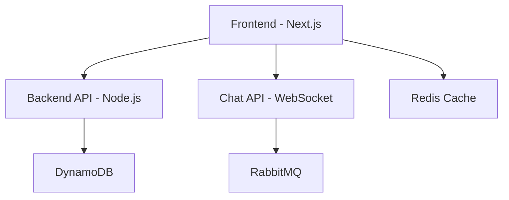

# Realchat Friendzone

A real-time chat application with friend management features, built with modern technologies and deployed on Kubernetes, built with microservices like Redis and RabbitMQ.

## 📁 Project Structure

```
realchat-friendzone/
├── app/
│   ├── backend/           # Node.js API server
│   ├── frontend/          # Next.js frontend application
│   └── chat-api/          # WebSocket server for chat and notifications
├── terraform/
│   ├── main/              # Main Terraform configuration
│   └── modules/           # Terraform modules for EKS setup
└── k8s/
    ├── k8s-basic/         # Basic Kubernetes configurations
    │   ├── deployments... # Deployment configurations
    │   ├── services...    # Service configurations
    │   └── ingress...     # Ingress configurations
    ├── environment/       # Helm charts for application components
    └── advance/           # Advanced Kubernetes configurations
```

## 🏗️ Application Components

### Backend (Node.js API)

The backend service handles user authentication, friend management, and data persistence. It's built with:

- Express.js for RESTful API endpoints
- DynamoDB for database storage
- JWT for authentication
- Input validation middleware
- Dockerized for containerized deployment

**Key Features:**
- User registration and authentication
- Friend requests and management
- User profile management
- Chat history persistence

### Frontend (Next.js)

The frontend provides a responsive user interface built with:

- Next.js for server-side rendering and routing
- React for component-based UI
- Tailwind CSS for styling
- Redis for data cache
- WebSocket client for real-time communication

**Key Features:**
- Responsive design for mobile and desktop
- Real-time chat interface
- Friend list and management
- User profiles and settings

### Chat API (WebSocket Server)

The chat-api handles real-time communication between users:

- Built with RabbitMQ for messaging
- Real-time message delivery
- User presence detection (online/offline)
- Typing indicators
- Notification system

## 🚀 Technology Stack

### Backend Technologies
- **Node.js** - Runtime environment
- **Express.js** - Web framework
- **DynamoDB** - Database
- **JWT** - Authentication
- **Docker** - Containerization

### Frontend Technologies
- **Next.js** - React framework
- **React** - UI library
- **Tailwind CSS** - Styling
- **WebSocket** - Real-time communication

### Infrastructure & DevOps
- **Kubernetes** - Container orchestration
- **Terraform** - Infrastructure as code
- **Redis** - Caching and session storage
- **RabbitMQ** - Message broker
- **Docker** - Containerization

## 🐳 Microservices Architecture

The application follows a microservices architecture with the following services:



# 🛠️ Infrastructure

This repository contains Kubernetes deployment configurations for a chat application with both **basic** and **advanced** deployment strategies. The project includes a microservices architecture with backend API, real-time chat API, and frontend components.

## 📁 Project Structure

```
k8s/
├── k8s-basic/          # Basic Kubernetes deployment
├── advance/            # Advanced deployment with GitOps
├── environment/        # Core cluster services and infrastructure
└── backup/             # Backup configurations
```

## 🏗️ Application Architecture

The application consists of three main services:
- **Backend**: REST API service handling user authentication, friend requests, and data management
- **Chat-API**: Real-time messaging service using WebSockets and RabbitMQ
- **Frontend**: Next.js web application providing the user interface

## 🚀 Deployment Options

### Basic Deployment (`k8s-basic/`)

**Best for**: Development, testing, and simple production environments

**Features**:
- Direct Kubernetes manifests
- Simple deployment and service configurations
- Manual deployment process
- Basic ingress configuration

**Components**:
```
k8s-basic/
├── backend/           # Backend service manifests
├── chat-api/          # Chat API service manifests  
├── frontend/          # Frontend service manifests
├── common/            # Shared ingress configurations
├── crds/              # Custom Resource Definitions
└── helm/              # Helm charts for dependencies
```

**Dependencies managed via Helm**:
- ArgoCD
- Ingress NGINX
- RabbitMQ
- Redis
- Zabbix (monitoring)

### Advanced Deployment (`advance/`)

**Best for**: Production environments requiring GitOps, blue-green deployments, and advanced monitoring

**Features**:
- GitOps workflow with ArgoCD
- Blue-green deployment strategy using Argo Rollouts
- Kustomize-based configuration management
- Advanced monitoring with Zabbix
- Horizontal Pod Autoscaling (HPA)
- Service mesh ready

**Components**:
```
advance/
├── argocd/            # ArgoCD application definitions
├── backend-base/      # Base backend configurations
├── chat-api-base/     # Base chat-api configurations
├── frontend-base/     # Base frontend configurations
├── overlay/           # Environment-specific overlays
├── helm/              # Advanced Helm configurations
├── crds/              # Custom Resource Definitions
└── volumes/           # Persistent volume configurations
```

**Key Advanced Features**:
- **Argo Rollouts**: Blue-green and canary deployments
- **Kustomize Overlays**: Environment-specific configurations
- **ApplicationSets**: Automated application management
- **Post-sync Hooks**: Automated post-deployment tasks

## 🛠️ Core Infrastructure (`environment/`)

The `environment/` directory contains essential cluster services required by both deployment strategies:

### Services Included:
- **ArgoCD**: GitOps continuous delivery tool
- **Ingress NGINX**: Ingress controller for traffic routing
- **Custom Resource Definitions**: Required CRDs for Argo Rollouts

### Installation Scripts:
- `helm-install.sh`: Install all required Helm charts
- `helm-uninstall.sh`: Remove all Helm installations
- `crds-install.sh`: Install custom resource definitions

## 🚦 Getting Started

### Prerequisites
- Kubernetes cluster (v1.20+)
- kubectl configured
- Helm 3.x installed
- (For advanced) ArgoCD CLI

### Basic Deployment

1. **Install core infrastructure**:
   ```bash
   cd environment/
   ./helm-install.sh
   ./crds-install.sh
   ```

2. **Deploy application services**:
   ```bash
   cd k8s-basic/
   kubectl apply -f backend/
   kubectl apply -f chat-api/
   kubectl apply -f frontend/
   kubectl apply -f common/
   ```

3. **Install dependencies**:
   ```bash
   cd helm/
   ./helm-install.sh
   ```

### Advanced Deployment

1. **Install core infrastructure**:
   ```bash
   cd environment/
   ./helm-install.sh
   ```

2. **Install Argo Rollouts CRDs**:
   ```bash
   cd advance/crds/
   kubectl apply -f argocd-rollouts/
   ```

3. **Deploy via ArgoCD**:
   ```bash
   cd advance/argocd/
   kubectl apply -f backend/
   kubectl apply -f chat-api/
   kubectl apply -f frontend/
   kubectl apply -f helm/
   ```

## 🔧 Configuration Management

### Basic Configuration
- Direct YAML manifests
- ConfigMaps and Secrets
- Environment variables via `.properties` files

### Advanced Configuration
- **Kustomize bases and overlays**
- **Image property injection**
- **Environment-specific configurations**
- **Automated configuration updates via GitOps**

## 📊 Monitoring and Observability

Both deployments include:
- **Zabbix**: Infrastructure and application monitoring
- **Ingress access logs**
- **Service health checks**

Advanced deployment additionally provides:
- **Rollout metrics via Argo Rollouts**
- **Deployment success/failure notifications**
- **Advanced Zabbix agent integration**

## 🔄 Deployment Strategies

### Basic Strategy
- **Rolling updates** (default Kubernetes behavior)
- Manual deployment process
- Simple rollback via `kubectl rollout undo`

### Advanced Strategy  
- **Blue-Green deployments** for zero-downtime updates
- **Automated rollbacks** on failure detection
- **Traffic splitting** during deployments/used Resource Hooks for service mapping

## 🌐 Networking

### Ingress Configuration
- **Basic**: Simple ingress rules in `common/`
- **Advanced**: Environment-specific ingress

### Service Communication
- **Backend ↔ Database**: Direct connection via DynamoDB
- **Chat-API ↔ RabbitMQ**: Message queue for real-time features
- **Frontend ↔ Backend/Chat-API**: API calls and WebSocket connections
- **Redis**: Session storage and caching

## 📋 Environment Variables

Key configuration files:
- `application.properties`: Application-specific settings
- `secret.properties`: Sensitive configuration (passwords, tokens)
- `image.properties`: Container image tags and registry info

### Local Development

1. **Clone the repository**:
   ```bash
   git clone <repository-url>
   cd realchat-friendzone
   ```

2. **Start with Docker Compose**:
   ```bash
   docker-compose up -d
   ```

3. **Install dependencies**:
   ```bash
   cd app/backend && npm install
   cd ../frontend && npm install
   cd ../chat-api && npm install
   ```

4. **Run services locally**:
   ```bash
   # Backend
   cd app/backend && npm run dev

   # Frontend
   cd app/frontend && npm run dev

   # Chat API
   cd app/chat-api && npm run dev
   ```

### Production Deployment

1. **Deploy infrastructure with Terraform**:
   ```bash
   cd terraform/main
   terraform init
   terraform plan
   terraform apply
   ```

2. **Deploy to Kubernetes**:
   ```bash
   # Basic deployment
   cd k8s/k8s-basic
   kubectl apply -f .

   # Or advanced deployment with ArgoCD
   cd k8s/advance
   kubectl apply -f argocd/
   ```

## 🔧 Configuration

### Environment Variables

**Backend**:
- `DynamoDB_URI` - DynamoDB connection string
- `JWT_SECRET` - JWT signing secret
- `REDIS_URL` - Redis connection URL

**Frontend**:
- `NEXT_PUBLIC_API_URL` - Backend API URL
- `NEXT_PUBLIC_WS_URL` - WebSocket server URL

**Chat API**:
- `RABBITMQ_URL` - RabbitMQ connection URL
- `REDIS_URL` - Redis connection URL

## 🎯 Features

### Real-time Communication
- Instant messaging between friends
- Typing indicators
- Online/offline status
- Message delivery confirmations

### Friend Management
- Send and receive friend requests
- Accept or decline requests
- Remove friends
- Block/unblock users

### User Experience
- Responsive design for all devices
- Dark/light theme support
- Emoji support in messages
- File sharing capabilities

## 📊 Monitoring and Observability

- **Health checks** for all services
- **Logging** with structured format
- **Metrics** collection for performance monitoring
- **Alerting** for critical issues

## 🔒 Security

- JWT-based authentication
- Input validation and sanitization
- Rate limiting on API endpoints
- CORS configuration
- Secure WebSocket connections

## 🧪 Testing

```bash
# Run backend tests
cd app/backend && npm test

# Run frontend tests
cd app/frontend && npm test

# Run chat-api tests
cd app/chat-api && npm test
```

## 📚 API Documentation

### Authentication Endpoints
- `POST /api/auth/register` - User registration
- `POST /api/auth/login` - User login
- `POST /api/auth/logout` - User logout

### Friend Management
- `GET /api/friends` - Get friend list
- `POST /api/friends/request` - Send friend request
- `PUT /api/friends/accept/:id` - Accept friend request
- `DELETE /api/friends/:id` - Remove friend

### Chat Endpoints
- `GET /api/chats` - Get chat history
- `POST /api/chats/message` - Send message
- `WebSocket /ws` - Real-time communication

